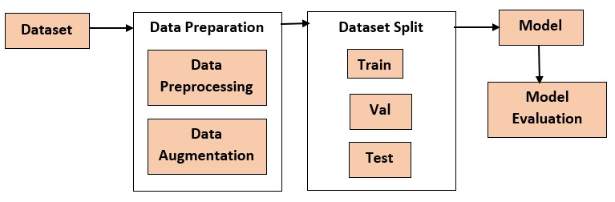

# Sign-Language-Recognition

## Introduction

A language translator is extensively utilized by the mute people for converting and giving shape to their thoughts. A system is in urgent need of recognizing and translating sign language.  
The proposed work aims at converting such sign gestures into text that can be understood by normal people. The entire model pipeline is developed by CNN architecture for the classification of 26 alphabets and one extra alphabet for null character. The proposed work has achieved an efficiency of 99.39%.

## Dataset

This dataset consists of 17,113 images belonging to 27 classes. The train folder has 12,845 images. It is split into train and validation sets with 10,284 and 2,561 images respectively. The test folder has 4,268 images.

Link: https://drive.google.com/drive/folders/16ce6Hc4U5Qr6YBArcozoYom6TT5-7oSc?usp=share_link 

## Flow

